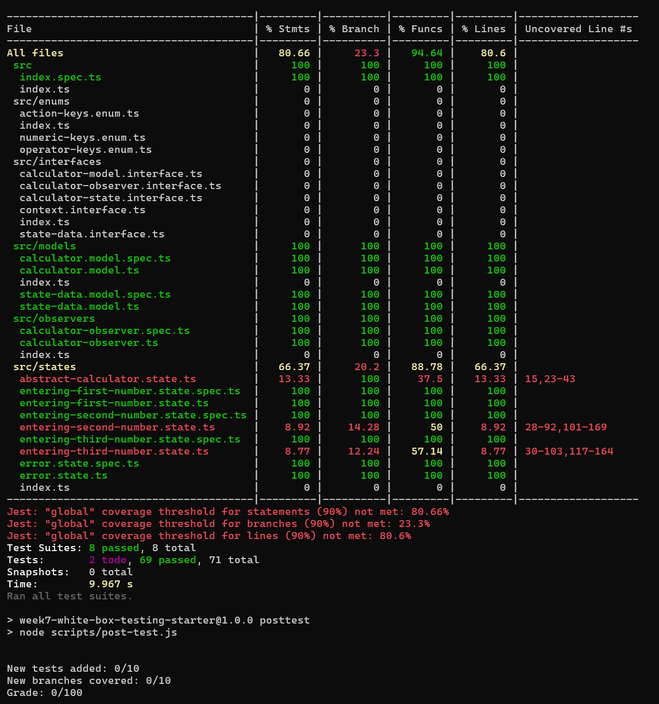
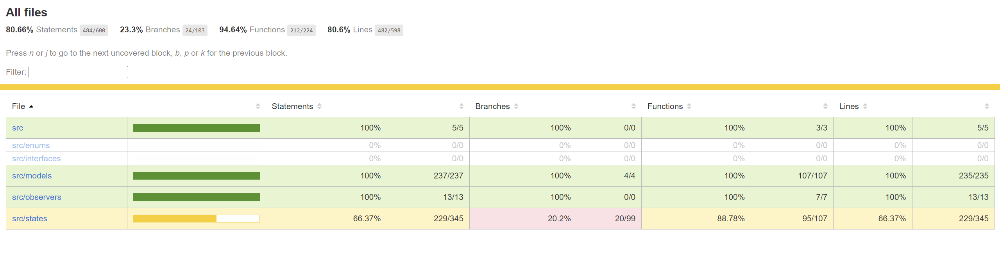
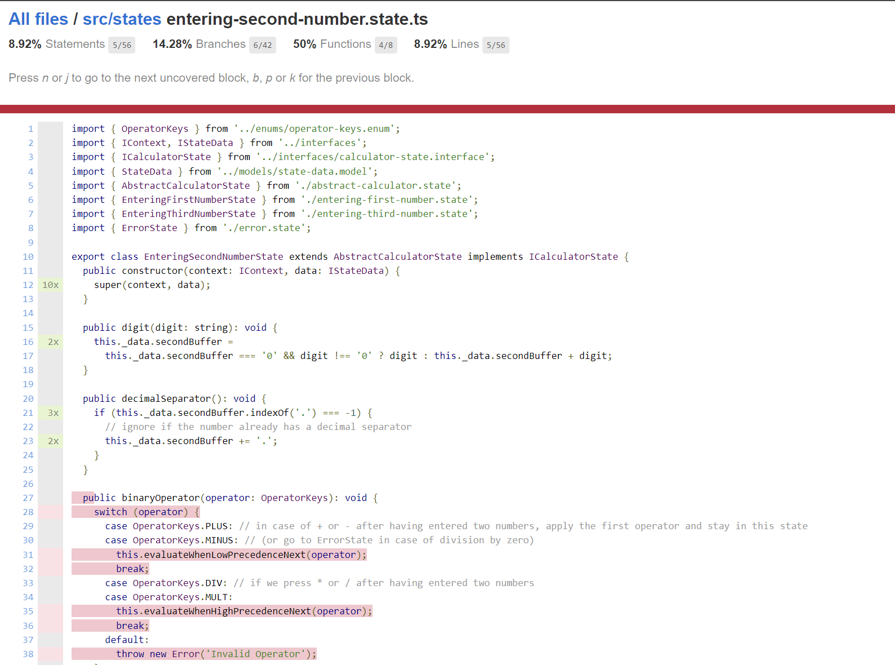

# Week 7 Activity - White Box Testing

Welcome back, fellow Software Engineers!
Last week you helped us find 7 bugs in our calculator implementation.
Your actions have impact, your efforts in the previous activity have forced our developer to write tests!
Staying true to the promise of preparing you for the real world, we have decided to reward your great work with *MORE* work `:)`.

Although the developer put in efforts to write some tests, the branch coverage on your calculator stands at an abysmal 23%.
This is simply unacceptable and we are counting on you to save the day once again.

- Your task for today, is to write 10 new tests in `entering-second-number.state.spec.ts` to cover 20 new branches in `entering-second-number.state.ts`.

## About the code

The calculator is the same one we implemented in Week 5 with the State Design Pattern.
At this point, you should be familiar with the files, methods, code organization, and scripts and we will not discuss them.
What we haven't discussed so far, however, is test coverage. 
So lets get started on that.
- Run `npm install` in the root of the project.
  - The root of the project is where the README.md and package.json are.
- Run `npm run test`.

You should see the below output:


The html report of the coverage can be found at `reports/coverage/lcov-report/index.html` and looks as below:


You can navigate to different files in the report to see which branches have not been covered yet:


Some interesting things to note:
- About coverage: 
  - We have more than 80% line, function, and statement coverage, but the branch coverage is only ~23%
  - This indicates that a large portion of our logic is concentrated in a few methods (which are untested).
- About the test summary:
  - `Tests:       2 todo, 69 passed, 71 total` 
  - There are 2 tests marked as TODO.
    - This is a jest feature which allows to create placeholders to implement tests later.


## Your Task

Your task today is to write tests for the 2 methods that have the `todo` tests.
The methods are `binaryOperator()` and `equals()` in `entering-second-number.state.ts`.
The tests are found in the corresponding `entering-second-number.state.spec.ts` file.
Within the spec files, find methods named `it.todo` and replace them with your own test suite with 10 new tests that cover 20 new branches.

### Writing your first test

Navigate to the test suite for `binaryOperator()` in `entering-second-number.state.spec.ts`.
On line 83, you should see the following code (replace it.todo with actual tests):
```typescript
describe('binaryOperator()', (): void => {
  it.todo('should do something');
});
```

### Code we want to test

Consider the code for `binaryOperator()` in `entering-second-number.state.spec.ts`.

```typescript
public binaryOperator(operator: OperatorKeys): void {
    switch (operator) {
      case OperatorKeys.PLUS: // in case of + or - after having entered two numbers, apply the first operator and stay in this state
      case OperatorKeys.MINUS: // (or go to ErrorState in case of division by zero)
        this.evaluateWhenLowPrecedenceNext(operator);
      // ...
```

When the second operator entered is either "PLUS" or "MINUS", we invoke `evaluateWhenLowPrecedenceNext()`.

Consider the code for `evaluateWhenLowPrecedenceNext()`:

```typescript
private evaluateWhenLowPrecedenceNext(nextOperator: OperatorKeys): void {
    const firstNumber: number = parseFloat(
      this._data.firstBuffer === '' ? '0' : this._data.firstBuffer
    );
    const secondNumber: number = parseFloat(
      this._data.secondBuffer === '' ? '0' : this._data.secondBuffer
    );

    switch (this._data.firstOperator) {
      case OperatorKeys.PLUS:
        this._data.firstBuffer = this.add(firstNumber, secondNumber).toString();
        break;
      // ...
    }
    this._data.secondBuffer = '';
    this._data.firstOperator = nextOperator;
}
```

### Assumptions for the first test

Let us assume the following when writing the first test:
- First number entered is 1.
- First operator entered is PLUS.
- Second number entered is 1.
- Second operator entered is PLUS.
- The method `add()` will give us the correct result (2).

### Expected outcomes

- `add()` should be invoked with 2 arguments (1, 1).
- `firstBuffer` should have the value "2".
- `secondBuffer` should be an empty string.
- `firstOperator` should have the operation PLUS. 

### Lets the write the test

Lets start by converting the `it.todo` to describe the scenario we are testing

```typescript
it('should convert to 1+1 to 2+', (): void => {

});
```

Let us begin by setting up the data for our test:

```typescript
it('should convert to 1+1 to 2+ when the next operator is +', (): void => {
  enteringSecondNumberState.data.firstBuffer = '1';
  enteringSecondNumberState.data.firstOperator = OperatorKeys.PLUS;
  enteringSecondNumberState.data.secondBuffer = '1';
});
```

Next, let us create a stub for `add()` that returns true:

```typescript
it('should convert to 1+1 to 2+ when the next operator is +', (): void => {

  enteringSecondNumberState.data.firstBuffer = '1';
  enteringSecondNumberState.data.firstOperator = OperatorKeys.PLUS;
  enteringSecondNumberState.data.secondBuffer = '1';
  
  jest.spyOn(enteringSecondNumberState, 'add').mockReturnValue(2);


});
```

Now we can invoke the method under test:

```typescript
it('should convert to 1+1 to 2+ when the next operator is +', (): void => {

  enteringSecondNumberState.data.firstBuffer = '1';
  enteringSecondNumberState.data.firstOperator = OperatorKeys.PLUS;
  enteringSecondNumberState.data.secondBuffer = '1';
  
  jest.spyOn(enteringSecondNumberState, 'add').mockReturnValue(2);

  enteringSecondNumberState.binaryOperator(OperatorKeys.PLUS);

});
```

Next, we can add assertions to verify different properties in our test:

```typescript
it('should convert to 1+1 to 2+ when the next operator is +', (): void => {

  enteringSecondNumberState.data.firstBuffer = '1';
  enteringSecondNumberState.data.firstOperator = OperatorKeys.PLUS;
  enteringSecondNumberState.data.secondBuffer = '1';
  
  jest.spyOn(enteringSecondNumberState, 'add').mockReturnValue(2);

  enteringSecondNumberState.binaryOperator(OperatorKeys.PLUS);

  expect(enteringSecondNumberState.data.firstBuffer).toEqual('2');
  expect(enteringSecondNumberState.data.firstOperator).toEqual(OperatorKeys.PLUS);
  expect(enteringSecondNumberState.data.secondBuffer).toEqual('');
  expect(enteringSecondNumberState.add).toHaveBeenCalledWith(1, 1);

});

```

Note: We do not need to restore the mock since we do that in `afterEach()`
```typescript
afterEach((): void => {
  jest.restoreAllMocks();
  enteringSecondNumberState = null;
  calculatorModel = null;
  stateData = null;
});
```

### Running the tests

You can run the tests with `npm run test` once you add more tests.
You should now see more branches covered and 1 less todo:

```
---------------------------------------|---------|----------|---------|---------|-----------------------
File                                   | % Stmts | % Branch | % Funcs | % Lines | Uncovered Line #s
---------------------------------------|---------|----------|---------|---------|-----------------------
All files                              |   82.59 |    28.15 |   95.55 |   82.53 |
```

```
Test Suites: 8 passed, 8 total
Tests:       1 todo, 70 passed, 71 total
```

Continue writing tests to get fill credit.

## Understanding The State Design

The State Design Pattern (for the calculator) revolves around 3 states (and a 4th Error state) and transitioning between them as more information becomes available.

1. Initialization:
  - On init, the calculator is in EnteringFirstNumberState
2. EnteringFirstNumberState
  - In this state, the calculator accepts 1 value in firstBuffer, and 1 operator in firstOperator.
  - When an operator is entered, we transition to EnteringSecondNumberState
3. EnteringSecondNumberState
  - EnteringSecondNumberState accepts 1 value in secondBuffer, and 1 operator in secondOperator.
  - When secondBuffer contains a value and user inputs the next operator
    - if firstOperator is high precedence,
      - evaluate the output of the first operation and store the result in firstBuffer
      - Store the newly entered operator in firstBuffer
      - stay in EnteringSecondNumberState
    - if new operator is low precedence,
      - evaluate the output of the first operation and store the result in firstBuffer
      - Store the newly entered operator in firstBuffer
      - stay in EnteringSecondNumberState
    - if new operator is high precedence,
      - store the operator in secondOperator
      - Transition to EnteringThirdNumberState 
4. EnteringThirdNumberState
  - EnteringThirdNumberState accepts 1 value in thirdBuffer, and 1 new operator.
  - If new operator is high precedence,
    - evaluate second and third buffer and store the result in secondBuffer
    - store the new operator in secondOperator
    - Stay in EnteringThirdNumberState
  - If new operator is low precedence
    - evaluate second and third buffer and store the result in secondBuffer
    - evaluate first and second buffer and store the result in firstBuffer
    - store the new operator in firstOperator
    - Transition to EnteringSecondNumberState

- Evaluate equals somewhat similarly and transition to error state if an invalid operation occurs.


## Submission

In the root directory, run the command `npm run zip`. 
This command will generate a zip file called `submission.zip`.
Upload the `submission.zip` file to Gradescope and tag your partner on Gradescope on the submission.


## Grading

You must write 10 new tests that cover 20 new branches to get full credit.
